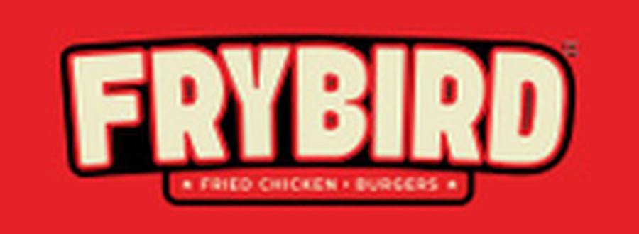

  

  <h1>FryBird POS</h1>
  
<b>Restaurant POS, kitchen display &amp; back-office for FryBird Fried Chicken &amp; Burgers</b> 
  Fried chicken &amp; burgers &middot; Halal

FryBird POS is a customised fork of [URY](https://github.com/ury-erp/ury), the open source restaurant
ERP built on Frappe/ERPNext. The Frappe app name stays `ury` so upgrades from upstream keep merging cleanly;
everything a guest or staff member sees is branded FryBird.

## What was customised

| Area | Change |
|---|---|
| Branding | FryBird logo, favicon, splash, Desk apps-screen tile, page titles across POS (`/pos`), admin (`/ury`), kitchen display (`/mosaic`), self-order (`/order`) and legacy POS (`/urypos`) |
| Theme | Shared theme (`packages/ui/src/styles/theme.css`) switched to FryBird red (`#E21F26`) with a golden-fried amber accent; hardcoded blue UI classes now follow the brand colour |
| Demo data | `ury/setup/demo_data/` replaced with the FryBird menu, Whitehall branch, Dining Room + Patio tables, Fry Station / Grill Station kitchens, raw ingredients and BOMs |
| Menu import | `ury/public/files/menu_template.csv` pre-filled with the FryBird menu |

## FryBird menu (demo data, AED, VAT 5% included)

| Course | Items |
|---|---|
| Fried Chicken | 2 PC Leg & Thigh 15 · 3 PC Leg, Thigh & Wing 22 · 5 / 8 / 10 / 15 PC Mix 29 / 48 / 55 / 77 |
| Chicken Wings | 4 / 6 / 8 / 10 / 15 / 20 PC 26 / 33 / 40 / 48 / 66 / 81 |
| Chicken Tenders | 3 / 6 / 12 PC 22 / 37 / 66 |
| Chicken Nuggets | 8 / 15 / 20 PC 18 / 33 / 44 |
| Burgers | Classic Fried Chicken 29 · Spicy Nashville Chicken 31 · Classic Beef 33 · Double Beef Cheese 44 · Chicken Burger Meal Combo 36 |
| Sides & Add-ons | Make it a Meal (Fries & Drink) 9 · Cheese Sauce on Fries 5 |
| Sauces | Honey Glaze · BBQ · Hot · Buffalo, 4 each |

> Prices converted from the printed USD menu (about 3.67 AED/USD, rounded to whole dirhams); burger prices are placeholders.
> Confirm all prices before going live. Menu photos: `ury/public/Images/menu/` (credits in `CREDITS.md`).

## Live demo data

`bench --site <site> execute ury.setup.live_seed.run` makes the site look like it is trading right now:
21 days of closed shifts (lunch and late-night peaks, 10:45 to 02:30), completed opening and closing checklists,
card and cash payments, about 40 customers, and tonight's open shift with occupied tables at every service stage
and orders on the kitchen display. Today's opening checklist is left pending so you see the checklist gate.
For local development, `scripts/wsl/rebuild-site.sh` rebuilds the whole site this way.

## Delivery platforms: Talabat & Keeta

Talabat and Keeta are set up as URY *aggregators* by `ury/setup/aggregators.py` (the live seed runs it; for a real
site run `bench --site <site> execute ury.setup.aggregators.setup_delivery_platforms --kwargs '{"branch": "<branch>"}'`).
Each platform gets:

| | Talabat | Keeta |
|---|---|---|
| Customer (billed party) | Talabat | Keeta |
| Price list | Talabat Menu: in-store price +15%, rounded up | Keeta Menu: in-store price +15%, rounded up |
| Mode of payment / account | Talabat → Talabat Settlements | Keeta → Keeta Settlements |

In the POS choose order type **Aggregators**, pick the platform, and the menu switches to that platform's prices;
payment defaults to the platform's mode of payment. Orders use the `FBA-` invoice series and are flagged on the
kitchen display. Adjust the markup in `PLATFORMS` (or edit the price lists directly) to match your commission deals.

## Getting started

Install exactly as upstream URY (see [INSTALLATION.md](INSTALLATION.md)), pointing `bench get-app` at this repository.
In the ERPNext setup wizard tick **Generate FryBird Demo Data** to load the menu, tables and kitchens above.
Demo staff logins: `cashier@frybird.test`, `captain@frybird.test`, `manager@frybird.test` (set passwords in Desk).

For a real (non-demo) setup, use the `/ury` configure wizard and import `menu_template.csv`.

---

# Upstream: URY
# URY - Open Source Restaurant Management System

URY is an open source ERP designed to simplify and streamline restaurant operations. It is built on top of  world's best free and open source ERP, ERPNext.

	<a href="https://frappecloud.com/dashboard/signup?product=ury" target="_blank">
		<picture>
			<source media="(prefers-color-scheme: dark)" srcset="https://frappe.io/files/try-on-fc-white.png">
			
		</picture>
	</a>

> :warning: Warning : 
> URY is currently in active development, and we are continuously making changes, updates, and working on new features and improvements. Please be aware that until a stable release is reached, backward compatibility is not guaranteed. We make every effort to maintain compatibility.

> :information_source: Note :
> Our system has been successfully running at scale, serving over 10+ outlets for the past 10 months.

## What It Includes
- **POS**: Dine‑in, takeaway, delivery, offline mode, printer management  
- **Kitchen Display**: Real‑time order queues, KOT printing  
- **Analytics**: P&L dashboard, consumption reports, item trends  

Given below is the list of features of URY app. 

### URY POS

**URY POS** is a light weight and easy to use web-based application designed for streamlined order management. It serves as an efficient tool for both cashiers and captains, facilitating order processing at the cash counter and tables.It supports various order types, including dine-in, delivery, takeout and Aggregator. URY POS is compatibile with a wide range of devices, including desktops, tablets, and smartphones. 

:information_source: **Note:**  
> To access the previous version of the separate URY POS app, [click here](https://github.com/ury-erp/pos).  
> **Use the URY branch `v1` to access these separate apps.**
> **Support for this version will end in December 2025.**

### URY MOSAIC

**URY MOSAIC** is an interactive Kitchen Display System (KDS) designed to simplify order management in both single and multi-kitchen restaurants. Additionally, it offers optional Kitchen Order Ticket (KOT) printing support for added convenience.

:information_source: **Note:**  
> To access the previous version of the separate URY MOSAIC app, [click here](https://github.com/ury-erp/mosaic).  
> **Use the URY branch `v1` to access these separate apps.**
> **Support for this version will end in December 2025.**

### Daily P & L and Reports
 URY has daily P & L and various reports. It helps restaurants to monitor daily Profit and Loss (P&L), utility consumption, disposables usage, and other key metrics with precision and ease. It provides restaurants with crucial data, enabling timely decision-making by presenting essential information and insights.
 
:information_source: **Note:**  
> To access the previous version of the separate URY PULSE app, [click here](https://github.com/ury-erp/pulse).  
> **Use the URY branch `v1` to access these separate apps.**
> **Support for this version will end in December 2025.**

## Features

### POS & Billing
* Role-based access with strict operational controls
* Pre-billing checklists to enforce compliance (e.g., stock check, hygiene checklist)
* Linked with stock and accounting modules
* Multi-format support: Table service, QSR, and takeaway
* Multi-cashier handling and terminal controls
* Advanced filters for order and bill management
* Modern, fast UI with guided flow
* Shift opening, closing, and cash reconciliation built-in

###  Menu & Recipe Management
* Centralized menu with outlet-level control
* Recipe mapping using Bill of Materials (BOM)
* Control pricing, availability, and portions per outlet
* Supports combos, modifiers, and item bundles
* Integrated with production planning for daily prep

### Table Order Management
* Mobile-first order taking for waitstaff
* Live sync with kitchen and cashier
* Real-time inventory checks before order placement
* Supports modifiers, course sequencing, and notes
* Seamless integration with billing and KDS

### Kitchen Display & KOT Management
* Supports multiple kitchens with advanced printer routing
* Interactive KDS with live status updates (Preparing, Ready, Served)
* Delay, cancellation, and modification tracking
* Real-time kitchen analytics
* Seamless flow from order to service across stations

### Operational Red Flags & Alerts
* Delayed orders and preparation time breaches
* KOT not started after order placement
* Unclosed bills and prolonged table occupancy
* Excessive KOT cancellations and modifications
* Real-time alerts for operational exceptions
* Dashboard view for quick issue resolution across outlets

### Reports & Analytics
* Daily Profit & Loss
* Shortage and Excess reporting
* Course-wise and item-wise performance
* Captain and staff performance tracking
* Branch-wise and outlet-wise comparisons
* Customer-wise sales trends
* Detailed sales, production, and stock reports
* Real-time operational insights for better decision-making

For more comprehensive list of features [go here.](FEATURES.md)

## Getting Started

To start using URY, you need to first install URY and then setup your first restaurant.

1. [URY Installation Guide](INSTALLATION.md).

2. [URY Setup Instructions](SETUP.md).

## Looking for other versions 	

1. Use branch `v1` to use ury [v0.1.0]

## About

URY is developed by [Tridz Technologies Pvt Ltd](https://tridz.com) and supported by [Frappe](http://frappe.io).

## Terms and Conditions

By using the URY, you agree to use it responsibly and in compliance with applicable laws. URY is built on open-source technology and is provided for your convenience to manage restaurant operations. While we strive to keep the app reliable, it is provided “as is” without any guarantees, and we are not responsible for any misuse or resulting issues.

[Read More](TERMS.md)